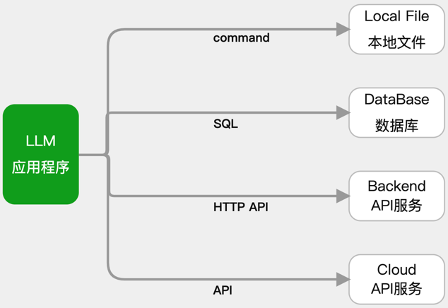
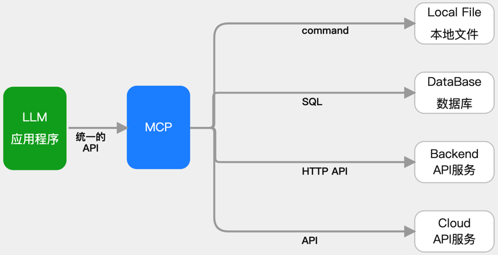
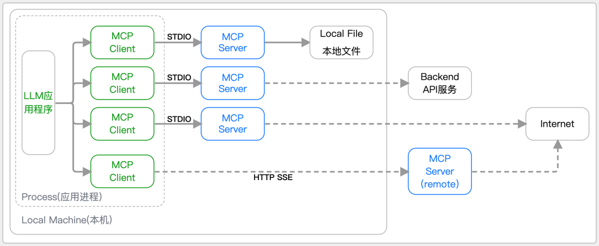
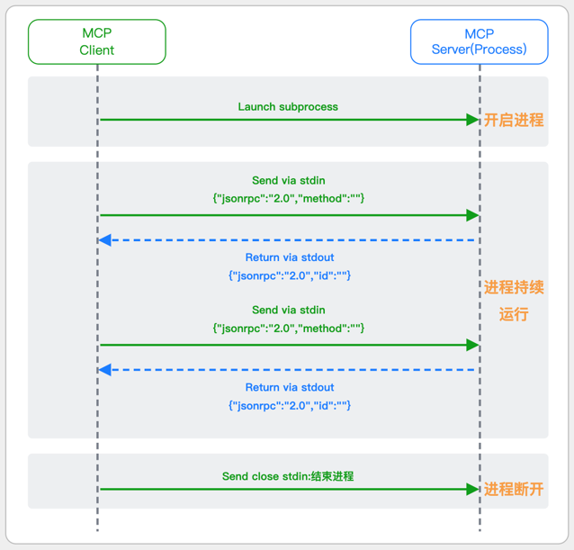
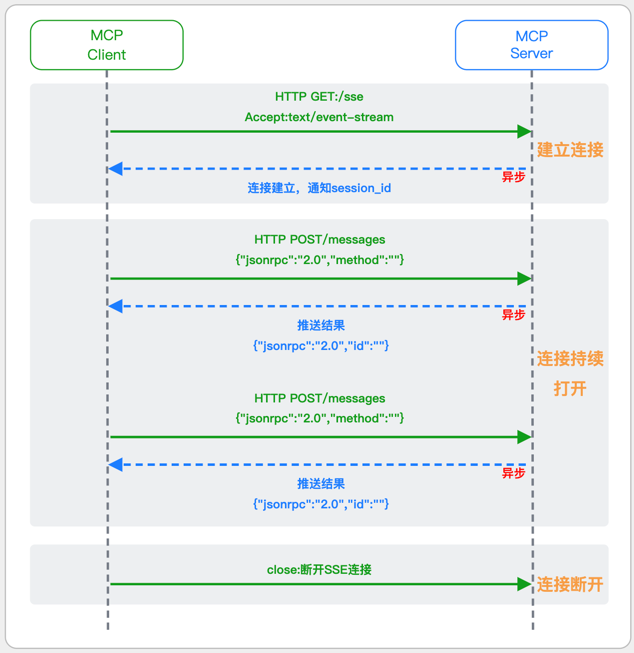
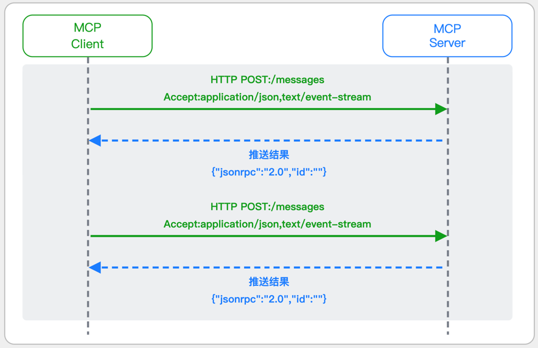

# 1 MCP概念介绍              
MCP官方简介:https://www.anthropic.com/news/model-context-protocol                                                                                    
MCP文档手册:https://modelcontextprotocol.io/introduction                                                 
MCP官方服务器列表:https://github.com/modelcontextprotocol/servers                        
PythonSDK的github地址:https://github.com/modelcontextprotocol/python-sdk                    

## 1.1 为什么出现MCP             
若开发一个不论是ChatBot还是复杂的Agent的AI应用，都不会再局限于简单的聊天对话，而是需要与外部世界连接，以访问数据源或使用工具                               
如访问本地文件、访问数据库结构、调用第三方API服务等                                      
那么就需要连接不同的对象，使用不同的接口协议，需要熟悉SQL、第三方开放API接口调用等，这都需要做大量的适配工作                      
                     
MCP(Model Context Protocol 模型上下文协议)，Anthropic开源，就是用来帮助简化LLM应用与这些外部资源间的集成                        
它允许LLM应用使用统一的协议来连接到这些外部资源，而不必逐个适配                      
                   
MCP的做法是增加了一个中间层：LLM应用通过统一的MCP协议连接中间层（称为MCP Server），而这个中间层会处理与外部资源的对接           

## 1.2 MCP有哪些好处                 
其实这是一种常见的设计范式，如一些大模型API代理平台就是把不同厂家的大模型协议转化成统一的OpenAI兼容协议，以方便应用接入                 
如推荐大家使用的代理平台:https://nangeai.top/register?aff=Vxlp                            
它的具体意义体现在:                     
(1)LLM应用的简化:不用适配各种私有协议，只需要知道怎么连接MCP server                        
(2)LLM应用的快速扩展:随时“插拔”新的MCP Server即可，一个不够就再来一个             
(3)快速适应变化:若一个外部资源的接口发生变化，只需要对它的MCP Server做修改，所有的LLM应用就可以无缝适应                
(4)新的AI能力共享生态:通过MCP Server的共享，新的LLM应用可以快速获得各种工具，形成了一种新的合作体系，提高整体效用               

## 1.3 基于MCP的集成架构
基于MCP将LLM应用与外部资源集成的架构可用下图表示:                
                            
相对于LLM应用直连外部资源，这里主要多了一个中间层（MCP Server），以及连接这个中间层的（MCP Client），理解了这两个，就理解了MCP                    
**(1)MCP Server**              
这里的Server不是传统意义上集中式的Server，可以理解成一个功能服务插件                   
MCP Server可以部署在LLM应用本机，也可以远程部署（Remote）                
MCP Server提供的能力有Tools,提供给LLM应用使用的工具;Resoures,提供给LLM应用一些额外的结构化数据;Prompts,提供给LLM应用的一些Prompt模板                       
MCP Server的获取可以是自己使用MCP SDK(目前支持TS/Python/Java)创建后供自己或企业内共享使用,也可以从他人创建的MCP Servers中“挑选”，然后下载使用             
MCP Server的启动方式，在本地模式下，在LLM应用中配置启动命令后，会自动启动MCP Server。MCP Server启动后的物理形式是一个独立的进程               
MCP Server与Client在本地模式下通过stdio/stdout（标准输入输出）的进程间通信进行消息交换，就如这段指令,cat file.txt | grep "南哥AGI研习社" > result.txt                
**(2)MCP Client**                
MCP Client是由LLM应用程序使用MCP SDK创建并维护的一个Server会话，就像在程序中维护一个数据库的Connection一样                    
借助MCP SDK可以与MCP Server通信,如查看Server的Tools                                
在本地模式下，Client与Server是一对一的关系。如果需要连接多个MCP Server，需要自行维护多个Session                    

# 2 MCP两大基础协议介绍         
## 2.1 消息协议:JSON-RPC 2.0
在MCP中规定了唯一的标准消息格式，就是JSON-RPC 2.0          
JSON-RPC 2.0是一种轻量级的、用于远程过程调用（RPC）的消息交换协议，使用JSON作为数据格式                            
**注意:** 它不是一个底层通信协议，只是一个应用层的消息格式标准                                              
这种消息协议的好处，语言无关(还有语言不支持JSON吗)、简单易用(结构简单，天然可读，易于调试)、轻量灵活(可以适配各种传输方式)            

## 2.2 传输协议:STDIO模式、基于SSE的Remote模式、Streamable HTTP             
### 2.2.1 STDIO模式                  
STDIO(Standard Input/Output)是一种基于标准输入(stdin)和标准输出(stdout)的本地通信方式                 
MCP Client启动一个子进程(MCP Server)并通过stdin和stdout交换JSON-RPC消息来实现通信          
**其基本通信过程如下:**               
             
**详细描述如下:**               
(1)启动子进程(MCP Server)                        
MCP Client以子进程形式启动MCP Server，通过命令行指定Server的可执行文件及其参数                       
(2)消息交换                                 
MCP Client通过stdin向MCP Server写入JSON-RPC消息                         
MCP Server处理请求后，通过stdout返回JSON-RPC消息，也可通过stderr输出日志                                      
(3)生命周期管理            
MCP Client控制子进程(MCP Server)的启动和关闭。通信结束后，MCP Client关闭stdin，终止MCP Server                   
### 2.2.2 基于SSE的Remote模式(MCP标准(2025-03-26版之前))          
SSE(服务器发送事件)是一种基于HTTP协议的单向通信技术，允许Server主动实时向Client推送消息，Client只需建立一次连接即可持续接收消息.它的特点是:            
单向(仅Server→Client)                  
基于HTTP协议，一般借助一次HTTP Get请求建立连接                  
适合实时消息推送场景(如进度更新、实时数据流等)                             
由于SSE是一种单向通信的模式，所以它需要配合HTTP Post来实现Client与Server的双向通信             
严格的说，这是一种HTTP Post(Client->Server)+HTTP SSE(Server->Client)的伪双工通信模式                 
**这种传输模式下:**            
一个HTTP Post通道，用于Client发送请求。比如调用MCP Server中的Tools并传递参数。注意，此时Server会立即返回               
一个HTTP SSE通道，用于Server推送数据，比如返回调用结果或更新进度                        
两个通道通过session_id来关联，而请求与响应则通过消息中的id来对应                     
**其基本通信过程如下:**                 
         
**详细描述如下:**             
(1)连接建立           
Client首先请求建立 SSE 连接，Server“同意”，然后生成并推送唯一的Session ID                  
(2)请求发送        
Client通过 HTTP POST 发送 JSON-RPC2.0 请求(请求中会带有Session ID 和Request ID信息)                        
(3)请求接收确认        
Server接收请求后立即返回 202(Accepted)状态码，表示已接受请求                
(4)异步处理          
Server应用框架会自动处理请求，根据请求中的参数，决定调用某个工具或资源                 
(5)结果推送      
处理完成后，Server通过 SSE 通道推送 JSON-RPC2.0 响应，其中带有对应的Request ID           
(6)结果匹配       
Client的SSE连接侦听接收到数据流后，会根据Request ID 将接收到的响应与之前的请求匹配              
(7)重复处理         
循环2-6这个过程。这里面包含一个MCP的初始化过程              
(8)连接断开             
在Client完成所有请求后，可以选择断开SSE连接，会话结束                
简单总结:通过HTTP Post发送请求，但通过SSE的长连接异步获得Server的响应结果                    
### 2.2.3 Streamable HTTP模式(MCP标准(2025-03-26版))       
在MCP新标准(2025-03-26版)中，MCP引入了新的Streamable HTTP远程传输机制来代替之前的HTTP+SSE的远程传输模式,STDIO的本地模式不变       
该新标准还在OAuth2.1的授权框架 、JSON-RPC批处理 、增强工具注解等方面进行增加和调整                   
且在2025.05.08号发布的MCP SDK 1.8.0版本中正式支持了Streamable HTTP              
**HTTP+SSE这种方式存在问题有:**              
需要维护两个独立的连接端点                 
有较高的连接可靠性要求。一旦SSE连接断开，Client无法自动恢复，需要重新建立新连接，导致上下文丢失                     
Server必须为每个Client维持一个高可用长连接，对可用性和伸缩性提出挑战                 
强制所有Server向Client的消息都经由SSE单向推送，缺乏灵活性              
**其主要变化部分的基本通信过程如下:**                  
         
**这里的主要变化包括:**                  
(1)Server只需一个统一的HTTP端点（/messages）用于通信                   
(2)Client可以完全无状态的方式与Server进行交互，即Restful HTTP Post方式                 
(3)必要时Client也可以在单次请求中获得SSE方式响应，如:一个需要进度通知的长时间运行的任务，可以借助SSE不断推送进度                 
(4)Client也可以通过HTTP Get请求来打开一个长连接的SSE流，这种方式与当前的HTTP+SSE模式类似               
(5)增强的Session管理。Server会在初始化时返回Mcp-Session-Id，后续Client在每次请求中需要携带该MCP-Session-Id。这个Mcp-Session-Id作用是用来关联一次会话的多次交互;Server可以用Session-Id来终止会话，要求Client开启新会话;Client也可以用HTTP Delete请求来终止会话                   
**Streamable HTTP在旧方案的基础上，提升了传输层的灵活性与健壮性:**                  
允许无状态的Server存在，不依赖长连接。有更好的部署灵活性与扩展能力              
对Server中间件的兼容性更好，只需要支持HTTP即可，无需做SSE处理                
允许根据自身需要开启SSE响应或长连接，保留了现有规范SSE模式的优势    
